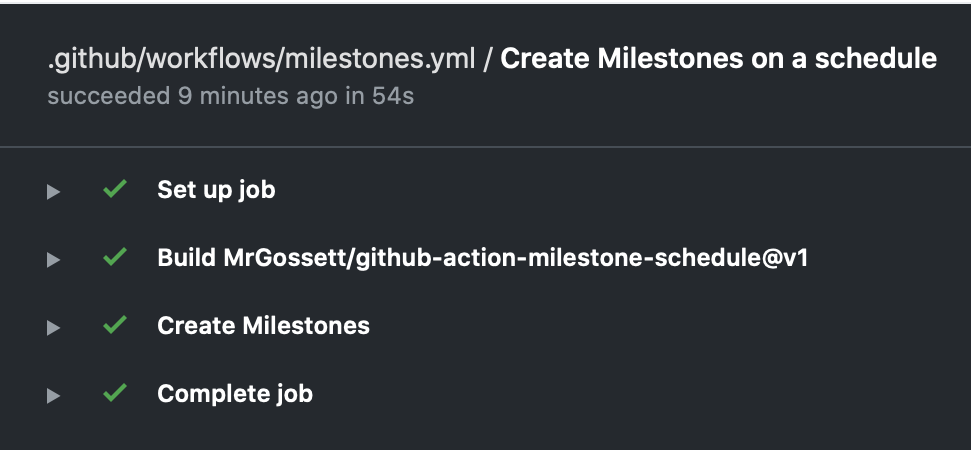
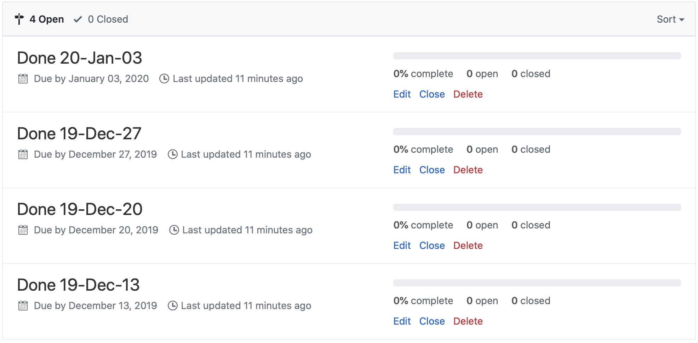

# Milestone Schedule GitHub Action

This action creates Issue Milestones in a GitHub repository, according to an
iCalendar (RFC 5545) Recurrence schedule.

## Inputs

### `recurrence`

**Required** The RFC 5545 Recurrence pattern defining a schedule of Milestone
due dates.

### `count`

**Required** The number of upcoming milestones that should be created each run.

### `format`

**Optional** A format string as specified in Golang's `time` package used to
determine each Milestone's title.
_defaults to `2006-01-02`_

## Example usage

```yaml
on:
  schedule:
    # Cron syntax has five fields separated by a space, and each field represents a unit of time.
    #
    #        ┌───────────── minute (0 - 59)
    #        │ ┌───────────── hour (0 - 23)
    #        │ │ ┌───────────── day of the month (1 - 31)
    #        │ │ │ ┌───────────── month (1 - 12 or JAN-DEC)
    #        │ │ │ │ ┌───────────── day of the week (0 - 6 or SUN-SAT)
    #        │ │ │ │ │
    #        │ │ │ │ │
    #        │ │ │ │ │
    #        * * * * *
    # * is a special character in YAML so you have to quote this string
    - cron:  '0 0 * * SUN' # midnight every Sunday

jobs:
  milestones:
    runs-on: ubuntu-latest
    name: Create Milestones on a schedule
    steps:
    - name: Create Milestones
      uses: MrGossett/github-action-milestone-schedule@v1
      env:
        GITHUB_TOKEN: ${{ secrets.GITHUB_TOKEN }}
      with:
        recurrence: 'FREQ=WEEKLY;BYDAY=FR;DTSTART=20191213T220000Z'
        format: 'Done 06-Jan-02'
        count: 4
```




